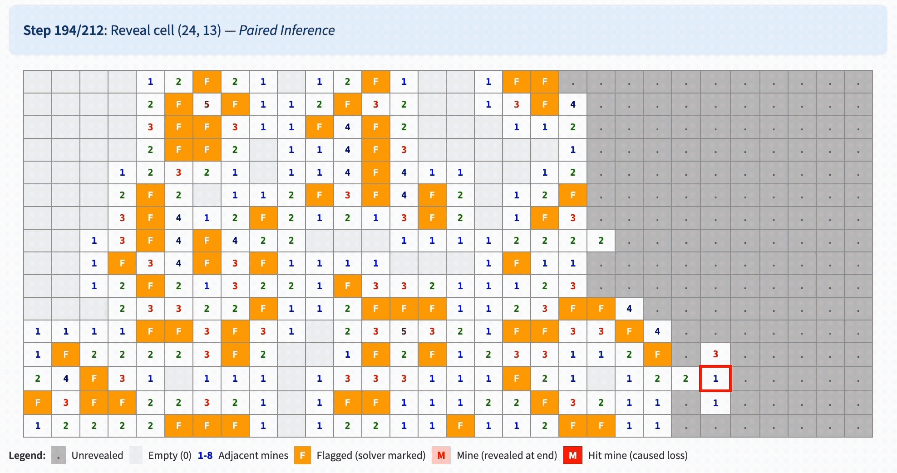

# Minesweeper AI Solver


A constraint-based Minesweeper AI solver that uses multiple inference strategies to achieve high win rates. The solver combines logical deduction with probabilistic guessing to solve boards of any difficulty level.

## Features

- **Multiple inference strategies**: Single constraint propagation, paired overlap analysis, SAT/DFS enumeration
- **Probabilistic guessing**: Bayesian estimation when no deterministic moves exist
- **Configurable difficulty**: Support for standard Minesweeper difficulty levels (Beginner, Intermediate, Expert) and custom board sizes
- **Two mine generation algorithms**: Safe first action rule and safe neighborhood rule
- **Interactive demo**: Streamlit web application to visualize the solver in action
- **Benchmarking tools**: Run multiple games and analyze win rates and inference statistics

## Paper

For a detailed explanation of the algorithms, constraint representation, and experimental results, see the accompanying paper:

📄 **[Minesweeper AI Solver: Constraint Satisfaction and Probabilistic Inference](docs/Minesweeper_Solver_Paper.pdf)**

## Installation

```bash
# Clone the repository
git clone https://github.com/artzhuravel/minesweeper-ai-solver.git
cd minesweeper-ai-solver

# Install dependencies
pip install -r requirements.txt

# Or install as a package
pip install -e .
```

## Quick Start

```python
from minesweeper import Minesweeper, MinesweeperSolver

# Create a game (Intermediate difficulty: 16x16, 40 mines)
game = Minesweeper(
    width=16,
    height=16,
    mines_count=40,
    mines_generation_algorithm="safe_neighborhood_rule"
)

# Create and run the solver
solver = MinesweeperSolver(game)
status, payload = solver.solve()

# Check result
if status == 1:
    print("Won!")
else:
    print("Lost :(")

print(f"Moves: {payload['reveal_moves_count']}")
print(f"Guesses needed: {payload['probabilistic_guesses_config_count']}")
```

## Interactive Demo




Run the Streamlit demo to visualize the solver:

```bash
pip install streamlit
streamlit run app/demo.py
```

The demo allows you to:
- Configure board size and mine count
- Choose between mine generation algorithms
- Select guessing strategy (Bayesian or Local Density)
- Watch the solver solve boards step-by-step with replay mode
- View detailed statistics about inference strategies used

## Algorithm Overview

The solver uses a tiered approach with four inference strategies:

1. **Single Inference**: Trivial constraint propagation (all safe or all mines)
2. **Paired Inference**: Overlap analysis between constraint pairs
3. **SAT/DFS Inference**: Configuration enumeration for connected components
4. **Probabilistic Guessing**: Bayesian estimation when no deterministic moves exist

For detailed explanations, proofs, and experimental results, see the [accompanying paper](docs/Minesweeper_Solver_Paper.pdf).

## Benchmarks

Typical win rates on standard difficulty levels (1000 games each):

| Difficulty | Board Size | Mines | Win Rate |
|------------|------------|-------|----------|
| Beginner | 9×9 | 10 | ~90% |
| Intermediate | 16×16 | 40 | ~75% |
| Expert | 30×16 | 99 | ~35% |

### Running Benchmarks

Run benchmarks from the command line using Python:

```bash
# Quick benchmark (100 games on Intermediate)
python -c "
from minesweeper import run_solver_many_tests
results = run_solver_many_tests(16, 16, 40, 100, 'safe_neighborhood_rule')
print(f\"Win rate: {results['win_rate']*100:.1f}%\")
print(f\"Avg guesses: {results['avg_guesses_total']:.1f}\")
"
```

Or use the Python API for more detailed analysis:

```python
from minesweeper import run_solver_many_tests, summarize_inference_mix

# Run benchmark
results = run_solver_many_tests(
    width=30, height=16, mines_count=99,
    runs=1000,
    mines_generation_algorithm="safe_neighborhood_rule"
)

print(f"Win rate: {results['win_rate']*100:.1f}%")
print(f"Avg moves: {results['avg_reveal_moves_count']:.1f}")
print(f"Avg guesses: {results['avg_guesses_total']:.1f}")

# Analyze inference strategy breakdown
mix = summarize_inference_mix(results)
print(f"Single inference: {mix['single_frac']*100:.1f}%")
print(f"Paired inference: {mix['paired_frac']*100:.1f}%")
print(f"DFS inference: {mix['dfs_frac']*100:.1f}%")
print(f"Guesses: {mix['guess_frac']*100:.1f}%")
```

## API Reference

### Core Classes

#### `Minesweeper(width, height, mines_count, mines_generation_algorithm)`

The game engine. Parameters:
- `width`, `height`: Board dimensions
- `mines_count`: Number of mines
- `mines_generation_algorithm`: `"safe_first_action_rule"` or `"safe_neighborhood_rule"`

Methods:
- `reveal(x, y)`: Reveal a cell, returns `(status, payload)`
- `format_board(reveal_all=False)`: Get string representation of board
- `print_board()`: Print visible board to stdout

#### `MinesweeperSolver(game, max_dfs_subgroup_len=inf, guessing_strategy="bayesian")`

The AI solver. Parameters:
- `game`: Minesweeper instance to solve
- `max_dfs_subgroup_len`: Limit on connected component size for SAT/DFS inference
- `guessing_strategy`: Strategy for probabilistic guessing:
  - `"bayesian"` (default): Use configuration-based Bayesian estimation for precise probabilities
  - `"local_density"`: Use local constraint density approximation (faster but less accurate)

Methods:
- `solve()`: Solve the game end-to-end, returns `(status, payload)`

### Analysis Functions

- `run_solver_single_test(...)`: Run one game and get detailed results
- `run_solver_many_tests(...)`: Run multiple games and get averaged statistics
- `run_solver_expert_level_analysis(...)`: Compare performance across difficulty levels
- `summarize_inference_mix(...)`: Analyze inference strategy breakdown

## Project Structure

```
minesweeper-ai-solver/
├── minesweeper/
│   ├── __init__.py      # Public API
│   ├── engine.py        # Minesweeper game engine
│   ├── solver.py        # AI solver implementation
│   ├── analysis.py      # Benchmarking and statistics
│   └── utils.py         # Helper functions
├── app/
│   └── demo.py          # Streamlit interactive demo
├── assets/
│   ├── win_demo_recording.gif   # Demo: solver winning
│   └── lose_demo_recording.gif  # Demo: solver losing
├── examples/
│   └── quickstart.py    # Usage examples
├── requirements.txt
├── pyproject.toml
└── README.md
```

## Mine Generation Algorithms

### Safe First Action Rule
Only the first clicked cell is guaranteed to be safe. This is the more challenging mode.

### Safe Neighborhood Rule
The first clicked cell AND its 8 neighbors are guaranteed safe. This is the standard Minesweeper behavior and gives the solver a better opening.

## License

MIT License - see [LICENSE](LICENSE) for details.

## Acknowledgments

This solver implements concepts from constraint satisfaction problems (CSP) and Bayesian probability theory. The core algorithms are based on well-established techniques in the Minesweeper solving community.
